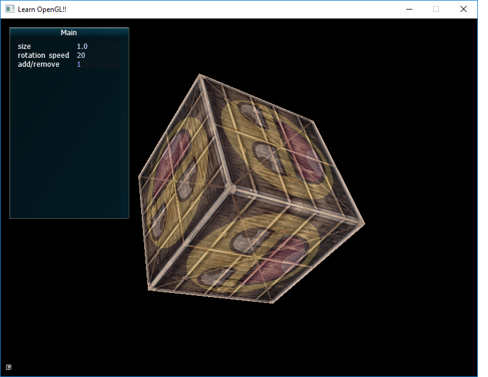
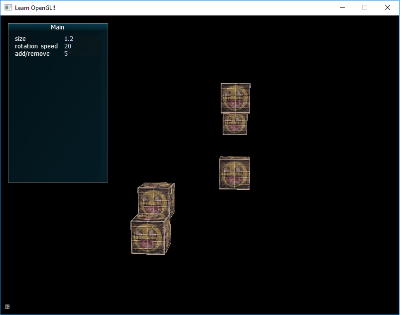
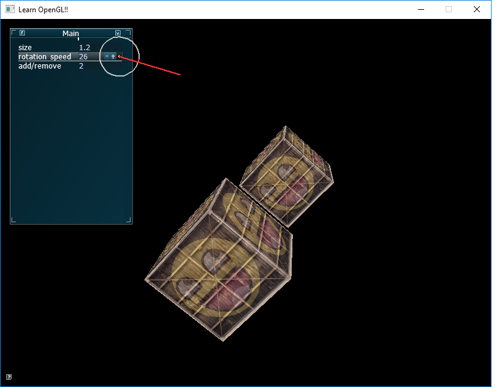

# 3-D cubes(OpenGL-C++)

This program uses OpenGL libraries to create a 3-D cube. The cube has 2 different textures mixed into the surface. With the help of AntTweakBar, the program has a small user interface where more 3-D cubes can be added or removed, the speed of the cubes can be controlled, along with it's size.

* One cube  with default parameters.

*Added cubes with no change in size and rotaion speed

*Modifying rotation speed

